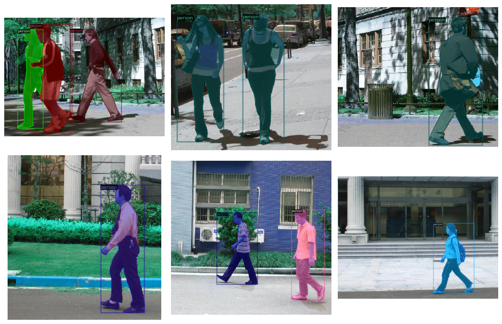
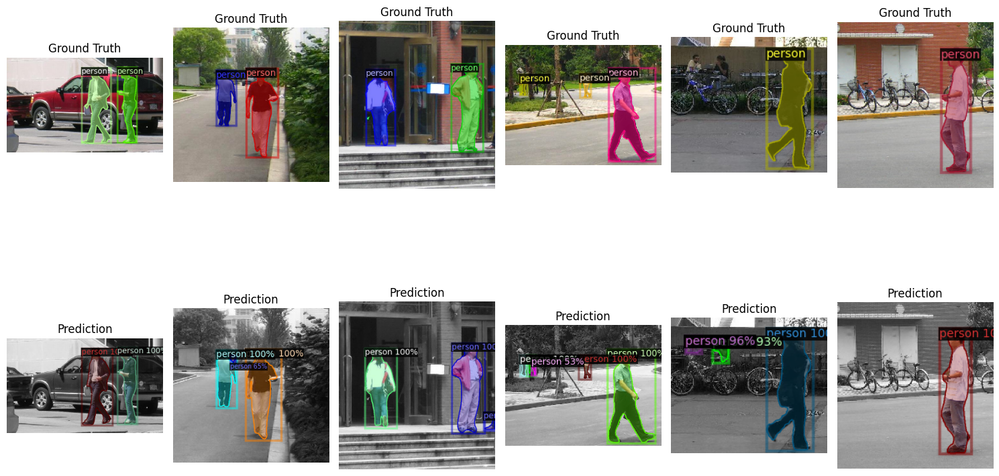
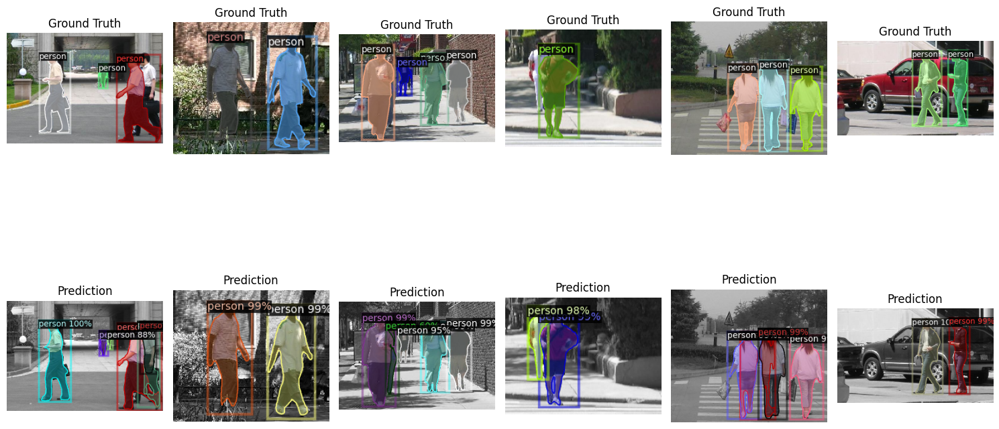

# Fine-Tuning Mask R-CNN on Penn-Fudan Dataset using Detectron2

## Objective

This project aims to evaluate the effectiveness of transfer learning by fine-tuning a pre-trained Mask R-CNN model (originally trained on the COCO dataset) on the Penn-Fudan pedestrian detection dataset. The goal is to assess improvements in both bounding box and instance segmentation performance after fine-tuning, and to provide an interactive demo using Gradio.

---

## Dataset: Penn-Fudan Pedestrian Detection

- **Source:** [Penn-Fudan Database for Pedestrian Detection and Segmentation](https://www.cis.upenn.edu/~jshi/ped_html/)
- **Description:** Contains 170 images with 345 labeled pedestrian instances.
- **Annotations:** Each image comes with corresponding segmentation masks and bounding boxes.
- **Format Used:** Converted to COCO-style dataset format for compatibility with Detectron2.
- **Classes:** Single class - *person*

---

## Approach

1. **Framework Used:** [Detectron2](https://github.com/facebookresearch/detectron2) by Facebook AI Research.
2. **Base Model:** `mask_rcnn_R_50_FPN_3x.yaml` from the `COCO-InstanceSegmentation` model zoo.
3. **Environment:** Implemented in [Google Colab](https://colab.research.google.com/) using PyTorch backend.
4. **Steps Followed:**
   - Loaded and visualized the Penn-Fudan dataset.
   - Converted annotations to COCO format.
   - Configured Detectron2 for custom training.
   - Fine-tuned the pre-trained COCO model on Penn-Fudan.
   - Evaluated performance before and after fine-tuning.
   - Created a Gradio demo for live inference on test images.

---

## Results

### Bounding Box Metrics (COCO Evaluation)

| Metric                      | Pre-trained (COCO) | Fine-tuned (Penn-Fudan) |
|----------------------------|--------------------|--------------------------|
| AP (bbox)                  | 80.61              | 82.039                   |
| AP50 (bbox)                | 97.81              | 98.157                   |
| AP75 (bbox)                | 94.22              | 94.55                    |
| AP_small (bbox)            | 59.78              | 68.91                    |
| AP_medium (bbox)           | 78.99              | 83.68                    |
| AP_large (bbox)            | 83.13              | 84.30                    |

### Segmentation Metrics (COCO Evaluation)

| Metric                      | Pre-trained (COCO) | Fine-tuned (Penn-Fudan) |
|----------------------------|--------------------|--------------------------|
| AP (segm)                  | 71.67              | 75.78                    |
| AP50 (segm)                | 97.81              | 98.15                    |
| AP75 (segm)                | 89.69              | 92.83                    |
| AP_small (segm)            | 40.59              | 44.33                    |
| AP_medium (segm)           | 62.67              | 61.12                    |
| AP_large (segm)            | 75.71              | 79.54                    |

### Predictions with pre-trained model

### Predictions with finetuned model

---

## Gradio Demo

Try out the fine-tuned model through an interactive demo built using [Gradio](https://gradio.app/):

It is included in the **demo.ipynb** notebook

## Conclusion

This project demonstrates the effectiveness of **transfer learning** in enhancing the performance of pre-trained instance segmentation models on small, domain-specific datasets.

By fine-tuning a COCO-pretrained Mask R-CNN model on the **Penn-Fudan pedestrian detection dataset**, we observed consistent improvements across multiple **bounding box** and **segmentation** metrics. Notably:
- **Bounding box AP** increased from **80.61** to **82.039**, with significant gains in **small object detection** (from **59.78** to **68.91**).
- **Segmentation AP** improved from **71.67** to **75.78**, with similar boosts in **fine-grained mask quality** and **large object handling**.

### Interpretation
These results show that even with a small dataset, **task-specific fine-tuning** allows the model to adapt to new visual patterns and environments, making it more accurate and robust. This is especially important in real-world applications where:
- Data is limited or highly specialized (e.g., surveillance, healthcare, manufacturing).
- Pre-trained general-purpose models need domain adaptation for better performance.
- Lightweight, reproducible pipelines like this one (Colab + Detectron2 + Gradio) enable **quick prototyping** and **interactive testing** without large infrastructure.

Overall, this project validates the power of **fine-tuning pre-trained vision models** and highlights a practical path for leveraging cutting-edge models in custom use cases.

## How to Run

This project was implemented in a **Google Colab** environment.

### Environment Setup
1. **Open the Colab notebook**
2. **Switch to GPU runtime**:  
   Go to `Runtime` > `Change runtime type` > Select `GPU` > Click `Save`.

### Dataset Setup
1. **Download the Penn-Fudan Dataset** from the [official link](https://www.cis.upenn.edu/~jshi/ped_html/PennFudanPed.zip).
2. **Upload the ZIP file** directly into the Colab runtime at the start itself.
3. The notebook automatically extracts the dataset and converts it to COCO format for training.

### Training the Model
- Run all cells in the notebook sequentially.
- After training, the model weights will be saved at:  
  `output_pennfudan/model_final.pth`

### Running the Gradio Demo
1. **Upload the trained weights** (`model_final.pth`) at the start.
2. Run the remaining cells to launch the Gradio interface.
3. Upload or select an image to test instance segmentation in real time.

